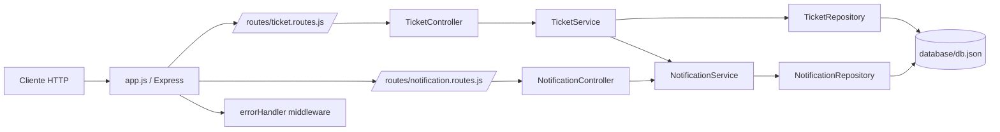

# API RESTful - Ticket Management & Notifications

<p align="center">
  
</p>

<p align="center">
  
  
  
  
  
</p>

API para gestionar **tickets de soporte** y su **historial de notificaciones** con una arquitectura por capas.

## Tabla de contenidos

- [1. Que hace este proyecto](#1-que-hace-este-proyecto)
- [2. Caracteristicas](#2-caracteristicas)
- [3. Arquitectura y flujo interno](#3-arquitectura-y-flujo-interno)
- [4. Estructura del proyecto](#4-estructura-del-proyecto)
- [5. Tecnologias](#5-tecnologias)
- [6. Instalacion y ejecucion](#6-instalacion-y-ejecucion)
- [7. Modelo de datos](#7-modelo-de-datos)
- [8. Reglas de negocio](#8-reglas-de-negocio)
- [9. Endpoints y contratos](#9-endpoints-y-contratos)
- [10. Manejo global de errores](#10-manejo-global-de-errores)
- [11. Escenario completo de prueba](#11-escenario-completo-de-prueba)
- [12. Limitaciones actuales](#12-limitaciones-actuales)
- [13. Mejoras sugeridas](#13-mejoras-sugeridas)

## 1. Que hace este proyecto

Este proyecto permite:

- Crear tickets de soporte con prioridad.
- Listar tickets de forma normal o paginada.
- Asignar un ticket a un usuario.
- Cambiar el estado del ticket.
- Eliminar tickets.
- Consultar todas las notificaciones.
- Consultar el historial de notificaciones de un ticket especifico.

Cada accion importante del ticket genera notificaciones automaticamente.

## 2. Caracteristicas

- Arquitectura por capas: `routes -> controllers -> services -> repositories`.
- Persistencia en archivo local `database/db.json`.
- Identificadores unicos con `uuid`.
- Logging HTTP con `morgan`.
- CORS habilitado.
- Middleware global `errorHandler` para respuestas de error consistentes.
- Paginacion en `GET /tickets` mediante `?page=&limit=`.

## 3. Arquitectura y flujo interno

### 3.1 Vista de componentes



### 3.2 Flujo de una solicitud

1. La solicitud entra por una ruta (`routes`).
2. El controlador interpreta parametros/body y delega la logica (`controllers`).
3. El servicio aplica reglas de negocio (`services`).
4. El repositorio lee/escribe en `db.json` (`repositories`).
5. Si ocurre un error, se propaga a `errorHandler`.

## 4. Estructura del proyecto

```text
.
├── app.js
├── controllers/
│   ├── NotificationController.js
│   └── TicketController.js
├── middlewares/
│   └── errorHandler.js
├── routes/
│   ├── notification.routes.js
│   └── ticket.routes.js
├── services/
│   ├── NotificationService.js
│   └── TicketService.js
├── repositories/
│   ├── BaseRepository.js
│   ├── NotificationRepository.js
│   └── TicketRepository.js
└── database/
    └── db.json
```

## 5. Tecnologias

- Node.js
- Express 5
- uuid
- morgan
- cors

## 6. Instalacion y ejecucion

### 6.1 Requisitos

- Node.js 18+
- npm

### 6.2 Instalacion

```bash
npm install
```

### 6.3 Ejecutar

Desarrollo:

```bash
npm run dev
```

Produccion/local simple:

```bash
npm start
```

Servidor:

- `http://localhost:3000`

## 7. Modelo de datos

### 7.1 Ticket

```json
{
  "id": "uuid",
  "title": "Error en login",
  "description": "No permite iniciar sesion",
  "status": "nuevo",
  "priority": "medium",
  "assignedUser": null
}
```

### 7.2 Notification

```json
{
  "id": "uuid",
  "type": "email",
  "message": "Nuevo ticket creado: Error en login",
  "status": "pending",
  "ticketId": "ticket-uuid"
}
```

## 8. Reglas de negocio

- Al crear ticket:
  - `status` inicia en `nuevo`.
  - `priority` por defecto es `medium` si no se envia.
  - `assignedUser` inicia en `null`.
  - Se crea notificacion tipo `email`.

- Al asignar ticket:
  - Se actualiza `assignedUser`.
  - Se crea notificacion tipo `email`.

- Al cambiar estado:
  - Se actualiza `status`.
  - Se crea notificacion tipo `push`.

- Al listar tickets:
  - Sin query params: devuelve arreglo plano de tickets.
  - Con `page` o `limit`: devuelve objeto paginado (`data` + `pagination`).

## 9. Endpoints y contratos

Base URL: `http://localhost:3000`

### 9.1 GET /

Descripcion: mensaje de bienvenida.

Respuesta 200:

```json
"¡Bienvenido a la API RESTful!"
```

### 9.2 POST /tickets

Descripcion: crea un ticket.

Body:

```json
{
  "title": "Error en login",
  "description": "No permite iniciar sesion",
  "priority": "high"
}
```

Respuesta 201:

```json
{
  "id": "uuid",
  "title": "Error en login",
  "description": "No permite iniciar sesion",
  "status": "nuevo",
  "priority": "high",
  "assignedUser": null
}
```

### 9.3 GET /tickets

Descripcion: lista tickets.

Sin paginacion (200):

```json
[
  {
    "id": "uuid",
    "title": "Error en login",
    "description": "No permite iniciar sesion",
    "status": "nuevo",
    "priority": "high",
    "assignedUser": null
  }
]
```

### 9.4 GET /tickets?page=1&limit=5

Descripcion: lista tickets paginados.

Respuesta 200:

```json
{
  "data": [
    {
      "id": "uuid",
      "title": "Error en login",
      "description": "No permite iniciar sesion",
      "status": "nuevo",
      "priority": "high",
      "assignedUser": null
    }
  ],
  "pagination": {
    "page": 1,
    "limit": 5,
    "total": 1,
    "totalPages": 1
  }
}
```

Errores posibles:

- 400 si `page` o `limit` no son enteros > 0.

### 9.5 PUT /tickets/:id/assign

Descripcion: asigna un usuario al ticket.

Body:

```json
{
  "user": "Rafael"
}
```

Respuesta 200: ticket actualizado.

Error 404: ticket no encontrado.

### 9.6 PUT /tickets/:id/status

Descripcion: actualiza el estado del ticket.

Body:

```json
{
  "status": "asignado"
}
```

Respuesta 200: ticket actualizado.

Error 404: ticket no encontrado.

### 9.7 DELETE /tickets/:id

Descripcion: elimina ticket.

Respuesta 200:

```json
{
  "message": "Ticket eliminado correctamente"
}
```

Error 404: ticket no encontrado.

### 9.8 GET /tickets/:id/notifications

Descripcion: historial de notificaciones filtrado por `ticketId`.

Respuesta 200:

```json
[
  {
    "id": "uuid",
    "type": "email",
    "message": "Nuevo ticket creado: Error en login",
    "status": "pending",
    "ticketId": "ticket-uuid"
  }
]
```

Nota: si no hay notificaciones para ese `ticketId`, devuelve `[]`.

### 9.9 GET /notifications

Descripcion: lista global de notificaciones.

Respuesta 200: arreglo de notificaciones.

## 10. Manejo global de errores

El proyecto centraliza errores en:

- `middlewares/errorHandler.js`

Registrado en `app.js` despues de las rutas:

```js
app.use(errorHandler);
```

Formato de error:

```json
{
  "error": "Mensaje de error"
}
```

Codigos usados actualmente:

- `400` para parametros invalidos de paginacion.
- `404` para operaciones sobre tickets inexistentes.
- `500` para errores no controlados.

## 11. Escenario completo de prueba

### 11.1 Crear ticket

```bash
curl -X POST http://localhost:3000/tickets \
  -H "Content-Type: application/json" \
  -d '{"title":"Bug UI","description":"Boton no responde","priority":"high"}'
```

### 11.2 Listar tickets paginados

```bash
curl "http://localhost:3000/tickets?page=1&limit=5"
```

### 11.3 Asignar ticket

```bash
curl -X PUT http://localhost:3000/tickets/<ticketId>/assign \
  -H "Content-Type: application/json" \
  -d '{"user":"Rafael"}'
```

### 11.4 Cambiar estado

```bash
curl -X PUT http://localhost:3000/tickets/<ticketId>/status \
  -H "Content-Type: application/json" \
  -d '{"status":"en_progreso"}'
```

### 11.5 Ver historial del ticket

```bash
curl http://localhost:3000/tickets/<ticketId>/notifications
```

### 11.6 Ver todas las notificaciones

```bash
curl http://localhost:3000/notifications
```

### 11.7 Probar error de paginacion

```bash
curl "http://localhost:3000/tickets?page=0&limit=5"
```

## 12. Limitaciones actuales

- No hay validacion estricta de payload para campos requeridos.
- Persistencia en archivo local (no apto para concurrencia/produccion).
- No existe autenticacion/autorizacion.
- `PORT` esta fijo en `3000`.
- No hay tests automatizados.

## 13. Mejoras sugeridas

- Integrar `Joi` o `Zod` para validaciones.
- Migrar a base de datos real (PostgreSQL/MongoDB).
- Agregar tests (`Jest` + `Supertest`).
- Agregar `.env` y `process.env.PORT`.
- Exponer documentacion OpenAPI/Swagger.
- Contenerizar con Docker.

---

<p align="center">
  
</p>
