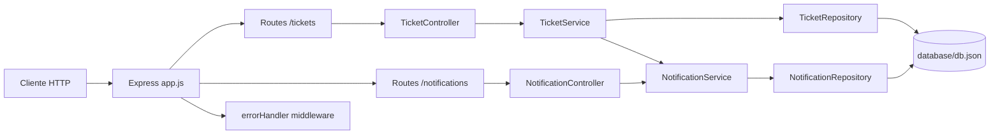

# API RESTful - Tickets & Notifications


API REST hecha con **Node.js + Express** para gestionar tickets y su historial de notificaciones.

Incluye:
- CRUD basico de tickets
- Asignacion y cambio de estado
- Historial de notificaciones por ticket
- Paginacion en listado de tickets
- Middleware global de manejo de errores

## Vista general



## Estructura del proyecto

```text
.
├── app.js
├── controllers/
│   ├── TicketController.js
│   └── NotificationController.js
├── middlewares/
│   └── errorHandler.js
├── routes/
│   ├── ticket.routes.js
│   └── notification.routes.js
├── services/
│   ├── TicketService.js
│   └── NotificationService.js
├── repositories/
│   ├── BaseRepository.js
│   ├── TicketRepository.js
│   └── NotificationRepository.js
└── database/
    └── db.json
```

## Tecnologias

- Node.js
- Express 5
- uuid
- cors
- morgan

## Instalacion

```bash
npm install
```

## Ejecucion

Modo normal:

```bash
npm start
```

Modo desarrollo:

```bash
npm run dev
```

Servidor por defecto: `http://localhost:3000`

## Endpoints

### 1) Health / bienvenida

- `GET /`

Respuesta:

```json
"¡Bienvenido a la API RESTful!"
```

### 2) Tickets

- `POST /tickets`
- `GET /tickets`
- `GET /tickets?page=1&limit=5`
- `PUT /tickets/:id/assign`
- `PUT /tickets/:id/status`
- `DELETE /tickets/:id`
- `GET /tickets/:id/notifications`

### 3) Notificaciones

- `GET /notifications`

## Ejemplos de uso (curl)

### Crear ticket

```bash
curl -X POST http://localhost:3000/tickets \
  -H "Content-Type: application/json" \
  -d '{
    "title": "Error en login",
    "description": "No permite iniciar sesion",
    "priority": "high"
  }'
```

Respuesta (201):

```json
{
  "id": "uuid",
  "title": "Error en login",
  "description": "No permite iniciar sesion",
  "status": "nuevo",
  "priority": "high",
  "assignedUser": null
}
```

### Listar tickets (sin paginacion)

```bash
curl http://localhost:3000/tickets
```

Respuesta (200):

```json
[
  {
    "id": "uuid",
    "title": "Error en login",
    "description": "No permite iniciar sesion",
    "status": "nuevo",
    "priority": "high",
    "assignedUser": null
  }
]
```

### Listar tickets con paginacion

```bash
curl "http://localhost:3000/tickets?page=1&limit=5"
```

Respuesta (200):

```json
{
  "data": [
    {
      "id": "uuid",
      "title": "Error en login",
      "description": "No permite iniciar sesion",
      "status": "nuevo",
      "priority": "high",
      "assignedUser": null
    }
  ],
  "pagination": {
    "page": 1,
    "limit": 5,
    "total": 1,
    "totalPages": 1
  }
}
```

Notas:
- Si no envias `page` y `limit`, responde arreglo simple.
- Si envias alguno, se activa respuesta paginada.
- Si `page` o `limit` <= 0 o no numerico, devuelve `400`.

### Asignar ticket

```bash
curl -X PUT http://localhost:3000/tickets/<ticketId>/assign \
  -H "Content-Type: application/json" \
  -d '{ "user": "Rafael" }'
```

### Cambiar estado

```bash
curl -X PUT http://localhost:3000/tickets/<ticketId>/status \
  -H "Content-Type: application/json" \
  -d '{ "status": "asignado" }'
```

### Eliminar ticket

```bash
curl -X DELETE http://localhost:3000/tickets/<ticketId>
```

### Historial de notificaciones por ticket

```bash
curl http://localhost:3000/tickets/<ticketId>/notifications
```

### Listar todas las notificaciones

```bash
curl http://localhost:3000/notifications
```

## Manejo global de errores

La API usa un middleware global en `middlewares/errorHandler.js` registrado en `app.js`:

```js
app.use(errorHandler)
```

Formato de error:

```json
{
  "error": "Mensaje de error"
}
```

Ejemplos:
- `400` cuando `page`/`limit` son invalidos.
- `404` cuando se intenta actualizar o eliminar un ticket inexistente.
- `500` para errores no controlados.

## Persistencia

Los datos se guardan en archivo local:

- `database/db.json`

Colecciones actuales:
- `tickets`
- `notifications`

## Flujo de notificaciones automaticas

Cada accion de ticket genera notificaciones:
- Crear ticket -> notificacion `email`
- Asignar ticket -> notificacion `email`
- Cambiar estado -> notificacion `push`

## Ideas de mejora

- Validaciones de payload (title, description, status, user)
- Variables de entorno para `PORT`
- Test automatizados (unit + integration)
- Persistencia en base de datos real (PostgreSQL / MongoDB)
- Documentacion OpenAPI/Swagger

---

Si quieres, en el siguiente paso te puedo dejar una version **README profesional para portafolio** (con mas imagenes y seccion de roadmap/checklist).
